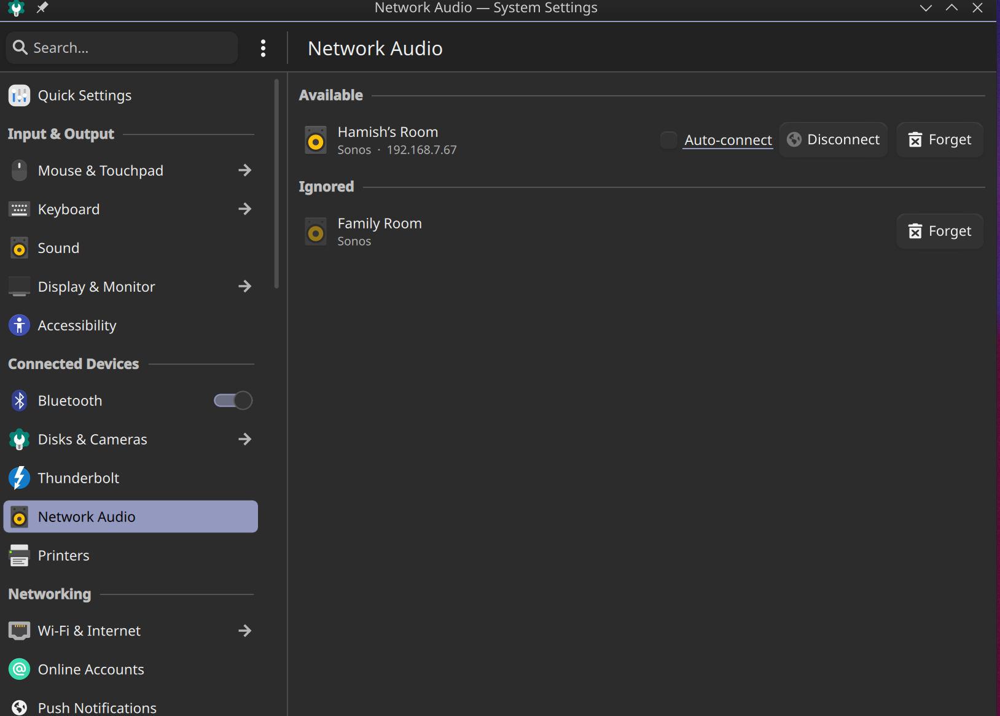

# Plasma Network Audio

> Disclaimer: This project was vibe coded to fix an issue I was having with how random network audio devices were automatically added as audio outputs in KDE Plasma/Pipewire. It works well for my use case but has had limited testing. So read the source code and use at your own risk.

This is a KDE Plasma system settings module for managing AirPlay/RAOP network audio devices. Currently KDE Plasma uses `libpipewire-module-raop-discover` to automatically discover and add audio sinks for all network audio devices on the network. This functionality can cause audio to output from devices that the user never explicitly connected to. This solution instead provides a Bluetooth-style UX to discover devices on the network and connect to them manually, with options for auto-connect and per-device preferences.

## Screenshot



## Features

- Discover AirPlay/RAOP devices on the local network
- Connect and disconnect devices on demand
- Auto-connect option per device
- Desktop notifications for newly discovered devices (Connect / Ignore)
- Remembers device preferences across sessions
- Detects device type (Apple TV, HomePod, Sonos, AirPort Express, etc.)

## Dependencies

- KDE Plasma 6
- KDE Frameworks 6: KCMUtils, KDBusAddons, KNotifications, KConfig, KCoreAddons, KI18n
- Qt 6: Core, DBus, Quick
- PipeWire with `libpipewire-module-raop-sink`
- Avahi

## Conflict with raop-discover

This application manually manages audio sinks for network devices. It conflicts with `libpipewire-module-raop-discover`, which automatically creates sinks for all discovered devices.

Before using this application, disable raop-discover by removing:

```
/usr/share/pipewire/pipewire.conf.d/50-raop.conf
```

On Fedora/Aurora this file is provided by the `pipewire` package. Removing it requires either a custom OS image or a local override.

## Building

```bash
cmake -B build -DCMAKE_INSTALL_PREFIX=~/.local
cmake --build build
cmake --install build
```

After installing, log out and back in for the kded module to load.
